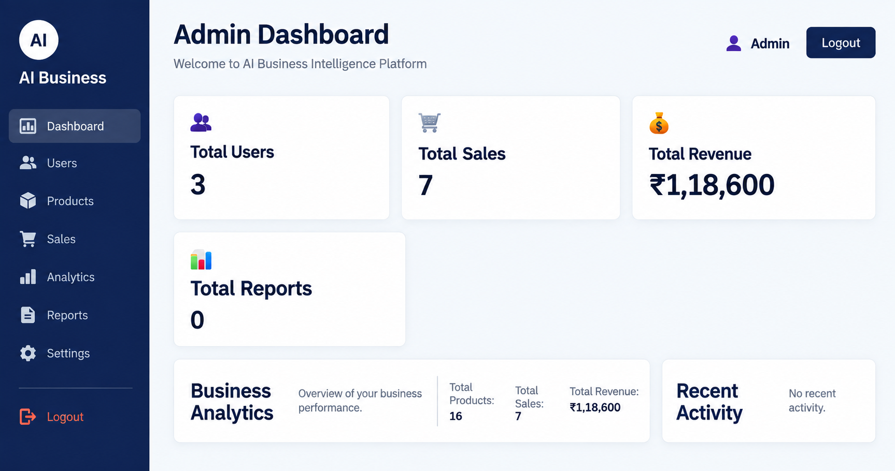
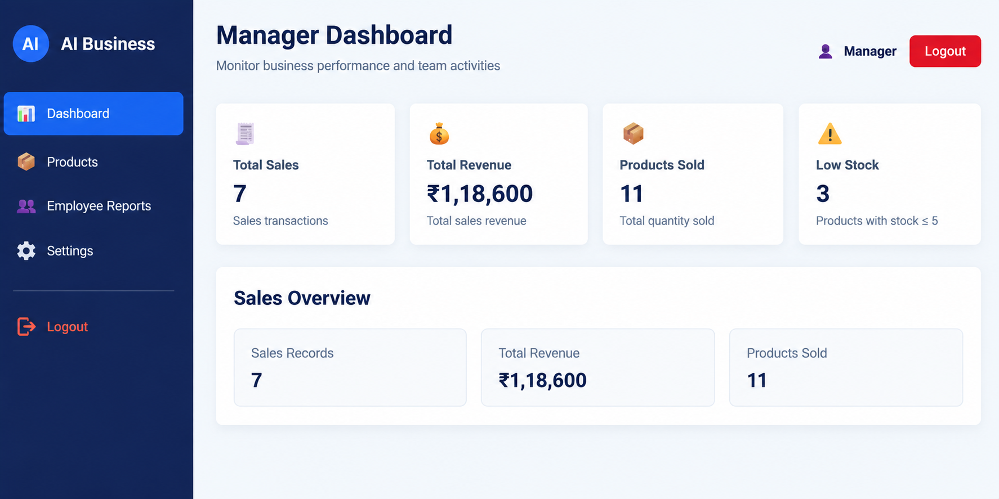
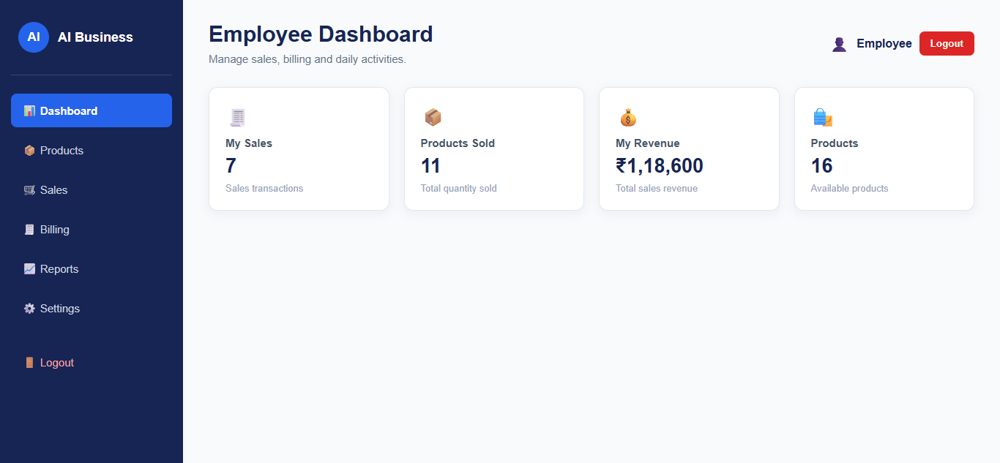

# AI Business Intelligence Platform with Machine Learning

A full-stack Business Intelligence and Management Platform built with Django REST Framework, React.js, relational databases, and Machine Learning.

---

## Live Demo

**Frontend Application:**  
https://ai-business-intelligence-platform-1.onrender.com

**Backend API:**  
https://ai-business-intelligence-platform-0fkp.onrender.com

**Source Code:**  
https://github.com/rohini-mylapilli/AI-Business-Intelligence-Platform

> The application is deployed on Render. PostgreSQL is used as the production database, while MySQL is used for local development.

> The backend is hosted on Render's free service and may take a short time to wake up after a period of inactivity.

---

# Application Preview

The platform provides dedicated dashboards for Admin, Manager, and Employee roles with role-based access to business operations and analytics.

## Admin Dashboard



## Manager Dashboard



## Employee Dashboard



---

# Project Overview

The **AI Business Intelligence Platform** is a full-stack business management and analytics application developed using **Python, Django, Django REST Framework, React.js, MySQL, PostgreSQL, and Machine Learning**.

The platform helps businesses manage daily operations and analyze performance through centralized dashboards, reports, role-based access, business analytics, and predictive insights.

The system enables users to:

* Login securely
* Access role-based dashboards
* Manage products
* Manage sales and billing
* Submit and review daily reports
* Monitor business analytics
* Track revenue and sales performance
* Use machine learning for sales prediction
* Access business data through REST APIs

---

# Project Objectives

* Build a centralized business management platform.
* Implement secure role-based authentication.
* Develop REST APIs using Django REST Framework.
* Integrate a React frontend with a Django backend.
* Manage product and sales operations.
* Provide daily reporting functionality.
* Generate business analytics and dashboards.
* Integrate machine learning for sales prediction.
* Deploy the complete application to a production environment.
* Build a scalable foundation for future AI-based business intelligence.

---

# System Architecture

```text
                    User
                      |
                      v
                React Frontend
                      |
                REST API Calls
                      |
                      v
          Django REST Framework
                      |
             JWT Authentication
                      |
              Role Permissions
                      |
              Business Logic
                      |
                Serializers
                      |
                Django Models
                      |
                Database Layer
                 /          \
                /            \
       MySQL (Local)    PostgreSQL (Production)
                              |
                       Analytics Module
                              |
                   Machine Learning Model
                              |
                       Sales Prediction
```

---

# Project Structure

```text
AI-Business-Intelligence-Platform/
|
|-- backend/
|   |
|   |-- accounts/
|   |-- analytics/
|   |-- config/
|   |-- dashboard/
|   |-- ml/
|   |-- products/
|   |-- reports/
|   |-- sales/
|   |
|   `-- manage.py
|
|-- frontend/
|   |
|   |-- public/
|   |-- src/
|   |   |
|   |   |-- assets/
|   |   |-- pages/
|   |   |-- api.js
|   |   |-- App.jsx
|   |   `-- main.jsx
|   |
|   |-- package.json
|   `-- vite.config.js
|
|-- screenshots/
|   |-- ai-business-admin.png
|   |-- ai-business-manager.png
|   `-- ai-business-employee.png
|
|-- .env
|-- .gitignore
|-- build.sh
|-- render.yaml
|-- README.md
`-- requirements.txt
```

---

# Backend Modules

## Accounts

Responsible for:

* User authentication
* Login
* JWT authentication
* User roles
* Role-based permissions
* Admin access control
* Manager access control
* Employee access control

---

## Products

Responsible for:

* Product creation
* Product listing
* Product editing
* Product categories
* Product management
* Role-based product permissions

---

## Sales

Responsible for:

* Sales creation
* Billing information
* Customer details
* Product-wise sales
* Quantity tracking
* Sales history
* Revenue calculation
* Sales-related business data

---

## Reports

Responsible for:

* Daily report creation
* Employee report submission
* Manager review
* Admin report management
* Report status tracking
* Report history
* Role-based report permissions

---

## Dashboard

Responsible for displaying important business information such as:

* Total Users
* Total Products
* Total Sales
* Total Reports
* Total Revenue
* Sales Summary
* Sales by Category
* Top-Selling Products
* Business Performance Overview

---

## Analytics

Responsible for:

* Total Sales
* Total Products
* Total Products Sold
* Total Revenue
* Today's Sales
* Monthly Sales
* Top-Selling Products
* Sales Trends
* Sales by Category
* Business Performance Analysis

---

## Machine Learning

Responsible for:

* Sales prediction
* Historical sales analysis
* Business forecasting support

Machine learning technologies used:

* Pandas
* NumPy
* Scikit-learn

The trained model is stored in:

```text
backend/ml/sales_model.pkl
```

Prediction logic is available in:

```text
backend/ml/sales_prediction.py
```

---

# User Roles

The system supports three main user roles.

## Admin

Admin has full system access and can:

* Access the Admin Dashboard
* Manage products
* Manage sales
* Manage daily reports
* View analytics
* Review business performance
* Access administrative operations

## Manager

Manager has operational and monitoring access and can:

* Access the Manager Dashboard
* View products
* Add and edit permitted product information
* Manage sales operations
* Review daily reports
* View analytics
* Monitor business performance

## Employee

Employee has limited operational access and can:

* Access the Employee Dashboard
* View permitted products
* Access permitted sales functionality
* Create daily reports
* Submit reports
* Access employee-related features

Administrative functionality is restricted based on role permissions.

---

# Frontend Pages

```text
Login
Admin Dashboard
Manager Dashboard
Employee Dashboard
Products
Sales
Billing
Reports
Analytics
Users
Settings
```

---

# Technology Stack

## Frontend

* React.js
* Vite
* JavaScript
* HTML5
* CSS3

## Backend

* Python
* Django
* Django REST Framework
* JWT Authentication
* Django CORS Headers
* Gunicorn

## Database

* MySQL — Local Development
* PostgreSQL — Production

## Machine Learning

* NumPy
* Pandas
* Scikit-learn

## Deployment

* Render Web Service — Django Backend
* Render Static Site — React Frontend
* Render PostgreSQL — Production Database
* Gunicorn — Production WSGI Server

## Development Tools

* Git
* GitHub
* VS Code
* Postman

---

# REST API Modules

```text
/api/auth/
/api/products/
/api/sales/
/api/reports/
/api/analytics/
/api/dashboard/
```

The APIs are protected based on authentication and user roles.

---

# API Flow

```text
React Frontend
      |
      v
REST API Request
      |
      v
Django REST Framework
      |
      v
Authentication & Permissions
      |
      v
Views
      |
      v
Serializers
      |
      v
Models
      |
      v
Database
(MySQL Local / PostgreSQL Production)
      |
      v
JSON Response
      |
      v
React User Interface
```

---

# Machine Learning Workflow

```text
Historical Sales Data
        |
        v
Data Processing
        |
        v
Machine Learning Model
        |
        v
Sales Prediction
        |
        v
Business Insights
```

---

# Production Architecture

```text
User Browser
     |
     v
React Frontend
(Render Static Site)
     |
     v
Django REST API
(Render Web Service)
     |
     v
PostgreSQL
(Render Database)
```

The frontend communicates with the production Django REST API using environment-based API configuration.

Production security configuration includes:

* `DEBUG=False`
* Environment-based Django Secret Key
* Production `ALLOWED_HOSTS`
* Restricted CORS origins
* Trusted CSRF origins
* HTTPS connections
* Environment-based database configuration

---

# Installation

## Clone Repository

```bash
git clone https://github.com/rohini-mylapilli/AI-Business-Intelligence-Platform.git
cd AI-Business-Intelligence-Platform
```

## Create Virtual Environment

### Windows

```bash
python -m venv venv
venv\Scripts\activate
```

## Install Backend Dependencies

```bash
python -m pip install -r requirements.txt
```

---

# Environment Configuration

Create a `.env` file in the project root.

```text
AI-Business-Intelligence-Platform/.env
```

Example local development configuration:

```env
DJANGO_SECRET_KEY=your_django_secret_key

DEBUG=True

ALLOWED_HOSTS=localhost,127.0.0.1

DB_NAME=ai_business_intelligence
DB_USER=root
DB_PASSWORD=your_mysql_password
DB_HOST=localhost
DB_PORT=3306

CORS_ALLOWED_ORIGINS=http://localhost:5173
CSRF_TRUSTED_ORIGINS=http://localhost:5173
```

The `.env` file contains sensitive information and should never be committed to GitHub.

Production configuration is managed securely through environment variables on Render.

---

# Local Database Setup

The application uses **MySQL for local development**.

Create the MySQL database:

```text
ai_business_intelligence
```

Then apply migrations:

```bash
python backend/manage.py migrate
```

In production, the application automatically connects to **PostgreSQL** using the configured `DATABASE_URL`.

---

# Run Backend Locally

From the project root:

```bash
python backend/manage.py runserver
```

Default backend URL:

```text
http://127.0.0.1:8000/
```

---

# Run Frontend Locally

Open a new terminal:

```bash
cd frontend
npm install
npm run dev
```

Default frontend URL:

```text
http://localhost:5173/
```

For local development, both the Django backend and React frontend should be running.

For normal production use or demonstration, the deployed application can be accessed directly through the Live Demo URL without starting the local servers.

---

# Production Deployment

The application is deployed using Render.

## Frontend

The React/Vite frontend is deployed as a **Render Static Site**:

```text
https://ai-business-intelligence-platform-1.onrender.com
```

## Backend

The Django REST Framework backend is deployed as a **Render Web Service** using Gunicorn:

```text
https://ai-business-intelligence-platform-0fkp.onrender.com
```

## Production Database

Production data is stored in **Render PostgreSQL**.

```text
Local Development -> MySQL
Production        -> PostgreSQL
```

This separation allows local development and testing without affecting production data.

---

# Frequently Used Django Commands

## System Check

```bash
python backend/manage.py check
```

## Create Migrations

```bash
python backend/manage.py makemigrations
```

## Apply Migrations

```bash
python backend/manage.py migrate
```

## View Migration Status

```bash
python backend/manage.py showmigrations
```

## Run Server

```bash
python backend/manage.py runserver
```

## Create Admin User

```bash
python backend/manage.py createsuperuser
```

## Run Tests

```bash
python backend/manage.py test
```

---

# Frequently Used Git Commands

```bash
git status
git add .
git commit -m "Update project"
git push origin main
```

---

# Testing

The project has been tested for:

* Authentication
* JWT-based authorization
* Role-based access
* Admin Dashboard
* Manager Dashboard
* Employee Dashboard
* Product management
* Sales and billing
* Daily reports
* Analytics
* REST API integration
* Machine learning functionality
* Database migrations
* Frontend and backend integration
* Production PostgreSQL integration
* Production frontend-to-backend communication
* Admin production login
* Manager production login
* Employee production login
* Production business data

Django system verification:

```bash
python backend/manage.py check
```

Expected output:

```text
System check identified no issues (0 silenced).
```

---

# Security

Sensitive information is managed using environment variables.

The following should not be committed to GitHub:

```text
.env
venv/
node_modules/
__pycache__/
*.pyc
db.sqlite3
media/
staticfiles/
```

Database exports, migration fixtures, credentials, secret keys, and other sensitive production data should also never be committed to the repository.

For production deployment:

* `DEBUG=False`
* Configure `ALLOWED_HOSTS`
* Use a strong Django Secret Key
* Use secure database credentials
* Use HTTPS
* Restrict CORS origins
* Configure trusted CSRF origins
* Store secrets using environment variables

---

# Current Project Status

```text
Authentication & Roles          Complete
Admin Dashboard                 Complete
Manager Dashboard               Complete
Employee Dashboard              Complete
Products                        Complete
Sales & Billing                 Complete
Reports                         Complete
Analytics                       Complete
REST API Integration            Complete
Frontend Integration            Complete
Machine Learning Prediction     Implemented
Professional UI                 Implemented
Render Frontend Deployment      Complete
Render Backend Deployment       Complete
PostgreSQL Production Database  Complete
Production Data Migration       Complete
Production Role Testing         Complete
GitHub Repository               Complete
```

The application has been successfully deployed and tested in the production environment.

---

# Future Enhancements

* Inventory Management
* Supplier Management
* Customer Management
* Expense Management
* Employee Attendance
* Payroll Management
* Advanced Sales Forecasting
* AI Business Recommendations
* Automated Alerts
* Exportable Business Reports
* Advanced Analytics Dashboard
* Mobile Application

---

# Developer

**Rohini Myalpilli**

Python Full Stack Developer

GitHub:  
https://github.com/rohini-mylapilli

---

# License

This project is developed for **educational, learning, demonstration, and portfolio purposes**.

The source code may be used and modified for personal learning and non-commercial projects with proper attribution to the developer.

Commercial use, redistribution, or claiming the project as original work without permission is not permitted.

**© 2026 Rohini Myalpilli. All rights reserved.**